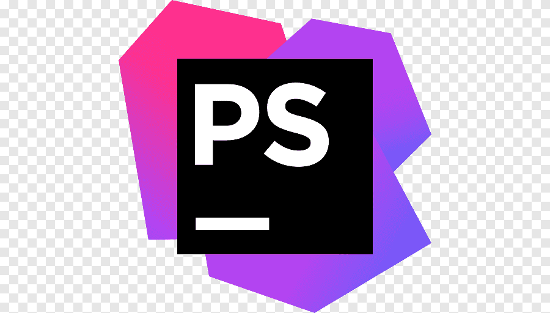

<h2>About me</h2>

<i>Hobby Frontend/Backend developer. More about me <a href="https://github.com/Volmarg/Volmarg/raw/main/data/nope.jpg">here</a></i>

<h2>Free time</h2>
<ul><li> E-guitar (generating loud noices) ,
<li>  Guild Wars 2 (slaying dragons),
<li> Coding (fixing bugs),
<li> Training (making space for more),</ul>

<h2>Tech stack</h2>

   
      
       
      
      
      
      
      
      
      
      
      
      
      
      
  

<h2>You can find me here</h2>

